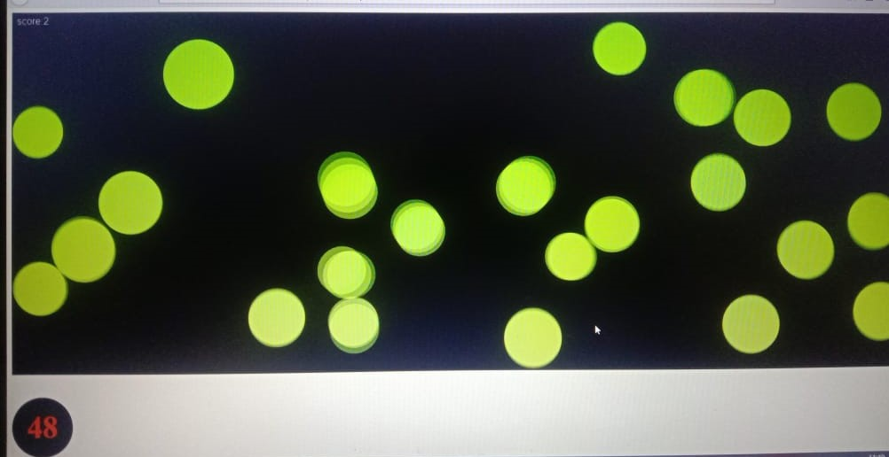

# bubble brust 

Its a game of randomly moving bubbles which brust when clicked , leading to formation of more bubbles of bigger size.
  
  
 
 
 User should keep brusting the bubbles , if he/she fails to do so and bubbles cover more than 75% of screen area then the user losses.
 points are provided to user on the basis of number of bubbles he/she brust.
 best score is maintained using local storage.
 

 
 Canvas was used with HTML and styling by CSS.
 
 
 
 CONTRIBUTOR :- Mansi Bisen
